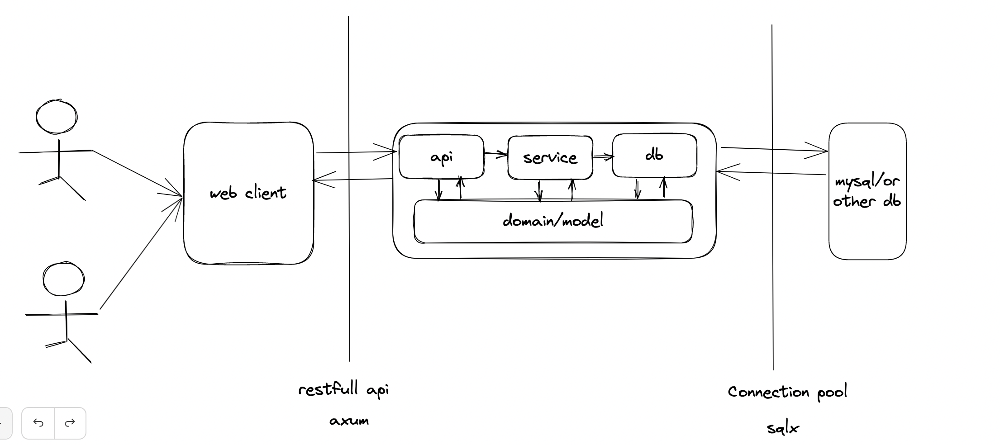

- Feature Name: 项目的整体框架
- Start Date: 2023-02-05

# Summary

[summary]: #summary

梳理代码组织结构

# Motivation

[motivation]: #motivation

代码组织结构清晰，可读性强，可维护性强，trace 日志的输出



# Guide-level explanation

[guide-level-explanation]: #guide-level-explanation

- 项目的整体框架 - 清晰
- 代码的可读性
- 代码的可维护性
- trace 日志的输出
- 整体规范的定义
- API 规范(restful api));

api 规范
1. 所有服务前缀为 /api/v1

公共返回结构


```rust
pub struct Resp {
    pub success: bool,
    pub data: <T>,
    pub error_code: u32,
    pub error_message: String,
    pub show_type: u32,
    pub trace_id: String,
}
pub struct Page<T> {
    pub list: Vec<T>,
    pub current: u32,
    pub page_size: u32,
    pub total: u32,
}
```

# Reference-level explanation

[reference-level-explanation]: #reference-level-explanation

[参考](https://github.com/amitshekhariitbhu/go-backend-clean-architecture)

[参考 2](https://github.com/lingdu1234/axum_admin)

# Drawbacks

[drawbacks]: #drawbacks

Why should we _not_ do this?

# Rationale and alternatives

[rationale-and-alternatives]: #rationale-and-alternatives

- Why is this design the best in the space of possible designs?
- What other designs have been considered and what is the rationale for not choosing them?
- What is the impact of not doing this?
- If this is a language proposal, could this be done in a library or macro instead? Does the proposed change make Rust code easier or harder to read, understand, and maintain?

# Prior art

[prior-art]: #prior-art

N/A

# Unresolved questions

[unresolved-questions]: #unresolved-questions

N/A

# Future possibilities

[future-possibilities]: #future-possibilities

N/A
